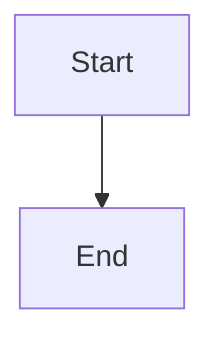

# Boran Uzun — Portfolio

Personal portfolio and blog built with Astro 6, TypeScript, and Tailwind CSS 4. Includes a blog, projects showcase, work experience timeline, an AI-powered chatbot, an interactive D3 knowledge graph, a command palette, RSS feed, sitemap, and static CV redirects.

Live site: **https://boranuzun.ch/**

---

## Table of Contents

- [Key Features](#key-features)
- [Tech Stack](#tech-stack)
- [Prerequisites](#prerequisites)
- [Getting Started](#getting-started)
- [Architecture Overview](#architecture-overview)
- [Content Authoring](#content-authoring)
- [Environment Variables](#environment-variables)
- [Available Scripts](#available-scripts)
- [Testing](#testing)
- [Linting and Formatting](#linting-and-formatting)
- [Deployment](#deployment)
- [CI/CD Pipeline](#cicd-pipeline)
- [Chatbot Worker](#chatbot-worker)
- [Troubleshooting](#troubleshooting)
- [License](#license)

---

## Key Features

- Static-by-default site with zero client-side JavaScript required for core content
- Content Collections for blog posts, projects, and work experience — all validated with Zod schemas
- Full MDX support with Mermaid diagram rendering and expressive code blocks (Vitesse theme)
- AI-powered chatbot backed by Google Gemini and deployed as a Cloudflare Worker with streaming responses
- Cloudflare AI Gateway integration for response caching and cost reduction
- Interactive D3 force-directed knowledge graph linking blog posts by shared tags
- Command palette (`Ctrl+K` / `Cmd+K`) for fast keyboard-driven navigation
- CRT overlay visual effect for the terminal aesthetic
- RSS feed aggregating both blog posts and projects
- Auto-generated sitemap and `robots.txt`
- PGP public key page and AGE public key page
- Dark/light mode with system preference detection
- Deployed automatically to GitHub Pages via GitHub Actions

---

## Tech Stack

| Layer                  | Technology                                                       |
| ---------------------- | ---------------------------------------------------------------- |
| **Framework**          | Astro 6                                                          |
| **Language**           | TypeScript 5                                                     |
| **Styling**            | Tailwind CSS 4 (via `@tailwindcss/vite`)                         |
| **Content**            | Astro Content Collections (MDX + Markdown)                       |
| **Code highlighting**  | astro-expressive-code (Vitesse Light/Dark themes)                |
| **Diagrams**           | rehype-mermaid (Playwright-rendered)                             |
| **Data visualisation** | D3 v7                                                            |
| **Icons**              | Lucide (via `@lucide/astro`)                                     |
| **Date handling**      | Day.js                                                           |
| **Class utilities**    | clsx + tailwind-merge                                            |
| **Chatbot AI**         | Google Gemini API (`@google/genai`)                              |
| **Chatbot runtime**    | Cloudflare Workers + Wrangler 4                                  |
| **AI caching**         | Cloudflare AI Gateway                                            |
| **Fonts**              | Geist (body), Lora (serif), JetBrains Mono (code) via Fontsource |
| **SEO**                | `@astrojs/sitemap`, `@astrojs/rss`                               |
| **Testing**            | Vitest (site), Vitest + Miniflare (chatbot worker)               |
| **Linting**            | ESLint 9 (flat config, Astro + TS + a11y rules)                  |
| **Formatting**         | Prettier (Astro + Tailwind plugins)                              |
| **Git hooks**          | Lefthook                                                         |
| **CI/CD**              | GitHub Actions → GitHub Pages                                    |

---

## Prerequisites

Make sure the following are installed on your machine before proceeding:

- **Node.js 24** (LTS recommended — this is what CI uses; other recent LTS versions likely work)
- **npm** (comes with Node.js; the repo uses `package-lock.json`)
- **Playwright / Chromium** — required at build time for Mermaid diagram rendering

Optional (only needed to work on the chatbot backend):

- A **Google Gemini API key** — obtain one at [Google AI Studio](https://aistudio.google.com/)
- A **Cloudflare account** with Workers enabled for deploying the chatbot

---

## Getting Started

### 1. Clone the repository

```bash
git clone https://github.com/boranuzun/portfolio.git
cd portfolio
```

### 2. Install dependencies

```bash
npm install
```

### 3. Install Playwright browsers

The build step uses Playwright to render Mermaid diagrams to SVG. Without Chromium present, `npm run build` will fail.

```bash
npx playwright install --with-deps chromium
```

> On CI, Playwright browsers are cached automatically (see `.github/workflows/ci.yml`). For local development the dev server does not render Mermaid diagrams, so this step is only required before running `npm run build`.

### 4. Start the development server

```bash
npm run dev
```

The site will be available at **http://localhost:4321**.

To expose the dev server on your local network (useful for testing on mobile):

```bash
npm run dev:network
```

### 5. (Optional) Set up the chatbot backend locally

See the dedicated [Chatbot Worker](#chatbot-worker) section below.

---

## Architecture Overview

### Directory Structure

```
portfolio/
├── .github/
│   └── workflows/
│       ├── ci.yml          # Lint, test, build on every push/PR to main
│       └── deploy.yml      # Deploy to GitHub Pages after CI passes
├── chatbot-worker/         # Cloudflare Worker — AI chatbot backend (separate npm workspace)
│   ├── src/
│   │   ├── index.ts        # Worker entry point: routing, CORS, rate limiting, Gemini streaming
│   │   └── prompt.ts       # System prompt with Boran's professional context and AI guardrails
│   ├── wrangler.toml       # Cloudflare Worker configuration
│   └── package.json
├── public/
│   ├── cv/                 # PDF CVs served as static files
│   ├── fonts/              # Self-hosted font files
│   ├── avatar.webp         # Profile picture
│   └── og-image.webp       # Open Graph image
├── src/
│   ├── components/         # Reusable Astro UI components
│   ├── content/
│   │   ├── blog/           # Blog posts (.md / .mdx)
│   │   ├── projects/       # Project entries (.md / .mdx)
│   │   └── work/           # Work experience entries (.md / .mdx)
│   ├── data/
│   │   └── skills.json     # Categorised skills data for the SkillGrid component
│   ├── layouts/
│   │   └── BaseLayout.astro  # Root HTML shell shared by all pages
│   ├── lib/
│   │   ├── __tests__/      # Vitest unit tests
│   │   ├── cmdk/           # Command palette implementation (actions, icons, renderer, state)
│   │   ├── collections.ts  # Helper to fetch only published (non-draft) entries
│   │   ├── graph.ts        # D3 graph data builder: maps blog posts → tag hub nodes
│   │   ├── schema.ts       # JSON-LD structured data builders (Person, Article, etc.)
│   │   ├── schema.types.ts # TypeScript types for schema objects
│   │   └── utils.ts        # cn(), formatDate(), readingTime(), dateRange()
│   ├── pages/
│   │   ├── index.astro     # Home: hero, skills grid, work, projects, blog, socials
│   │   ├── 404.astro
│   │   ├── keys.astro      # PGP and AGE public key display
│   │   ├── privacy.astro
│   │   ├── robots.txt.ts   # Dynamically generated robots.txt
│   │   ├── rss.xml.ts      # RSS feed (blog + projects combined)
│   │   ├── search-index.json.ts  # JSON search index for the command palette
│   │   ├── blog/
│   │   │   ├── index.astro       # Blog listing with D3 knowledge graph
│   │   │   └── [...slug].astro   # Individual blog post with ToC, reading time, prev/next
│   │   ├── projects/
│   │   │   ├── index.astro
│   │   │   └── [...slug].astro
│   │   └── work/
│   │       └── index.astro
│   ├── scripts/
│   │   └── toc.ts          # Client-side table-of-contents scroll-spy
│   ├── styles/
│   │   └── global.css      # Tailwind directives + CSS custom properties (design tokens)
│   ├── consts.ts           # Site-wide constants: name, email, item counts, social links, keys
│   ├── content.config.ts   # Content Collection definitions and Zod schemas
│   ├── env.d.ts            # Astro environment type declarations
│   └── types.ts            # Shared TypeScript types (Site, Metadata, Socials)
├── astro.config.mjs        # Astro configuration: integrations, fonts, Vite plugins, markdown
├── eslint.config.js        # ESLint 9 flat config
├── lefthook.yml            # Git hooks: auto-format staged files on commit
├── remark-modified-time.mjs  # Remark plugin: injects lastModified from git history
├── tsconfig.json           # TypeScript config with path aliases (@*)
└── vitest.config.ts        # Vitest config for src/__tests__
```

### Page Routes

| URL                  | Description                                    |
| -------------------- | ---------------------------------------------- |
| `/`                  | Home page — hero, skills, work, projects, blog |
| `/blog`              | Blog index with D3 tag graph                   |
| `/blog/[slug]`       | Individual blog post                           |
| `/projects`          | Projects listing                               |
| `/projects/[slug]`   | Individual project                             |
| `/work`              | Work experience timeline                       |
| `/keys`              | PGP and AGE public keys                        |
| `/privacy`           | Privacy policy                                 |
| `/rss.xml`           | RSS feed (blog + projects)                     |
| `/sitemap-index.xml` | Auto-generated sitemap                         |
| `/robots.txt`        | Auto-generated robots file                     |
| `/search-index.json` | Search index consumed by the command palette   |

### Key Components

**`Head.astro`**
Handles all `<head>` metadata including Open Graph tags, canonical URLs, JSON-LD structured data (via `src/lib/schema.ts`), and font preloads. Also initialises the CRT overlay effect.

**`CommandPalette.astro`**
A full-featured keyboard-driven command palette (opened with `Ctrl+K` / `Cmd+K`). It fetches the `search-index.json` endpoint and uses the `src/lib/cmdk/` module for actions, keyboard navigation, and rendering. Supports navigating to pages, copying links, and toggling dark mode.

**`ForceGraph.astro`**
Renders an interactive D3 v7 force-directed graph on the blog index page. Nodes represent blog posts (leaf) and tags (hub). Posts sharing a tag are visually linked. Clicking a post node navigates to it. The graph data is built server-side by `src/lib/graph.ts`.

**`CRTOverlay.astro`**
Injects a CSS-based CRT scanline and flicker overlay for the terminal aesthetic, togglable by the user.

**`TableOfContents.astro`**
Generates a floating table of contents for blog/project pages. Scroll-spy behaviour is powered by `src/scripts/toc.ts`.

**`SkillGrid.astro`**
Renders categorised skill badges from `src/data/skills.json`.

**`Schema.astro`**
Injects JSON-LD structured data (Person, BlogPosting, CreativeWork schemas) built by `src/lib/schema.ts`.

### Build Pipeline

```
npm run build
    │
    ├── astro check          (TypeScript type-check all .astro files)
    │
    └── astro build
            │
            ├── Remark: remarkModifiedTime   (inject git last-modified date into frontmatter)
            ├── Rehype: rehypeMermaid         (Playwright/Chromium renders Mermaid → SVG)
            ├── astro-expressive-code         (syntax highlights code blocks)
            ├── @astrojs/mdx                  (MDX → HTML)
            ├── @astrojs/sitemap              (generates /sitemap-index.xml)
            └── Output: dist/                 (fully static site, ready to deploy)
```

### Chatbot Architecture

```
Browser (CommandPalette chat UI)
    │  POST /chat  { message, history[] }
    ▼
Cloudflare Worker (chatbot-worker)
    │  Rate limit check (20 req/min per IP)
    │  CORS validation (boranuzun.ch + localhost:4321)
    │  Message validation (max 2000 chars)
    ▼
Cloudflare AI Gateway  (optional — caches responses for 1 week)
    │
    ▼
Google Gemini API (gemini-3.1-flash-lite-preview)
    │  Streaming response
    ▼
TransformStream → streamed text/plain back to browser
```

The system prompt in `chatbot-worker/src/prompt.ts` constrains the bot strictly to Boran's professional background and enforces guardrails against off-topic questions.

---

## Content Authoring

All content lives under `src/content/` and is validated at build time against Zod schemas defined in `src/content.config.ts`.

### Blog Posts (`src/content/blog/`)

Create a `.md` or `.mdx` file. The filename becomes the URL slug.

```yaml
---
title: "My Post Title"
description: "A short description shown in listings and meta tags."
date: 2025-06-15
tags: ["devops", "homelab"] # optional — used in the D3 knowledge graph
draft: false # set to true to hide from all listings
---
Your Markdown content here.
```

MDX files can import and use Astro/React components inline.

Mermaid diagrams are supported in fenced code blocks:

````md

````

These are rendered to SVG at build time via Playwright. The Chromium binary must be installed (see [Prerequisites](#prerequisites)).

### Projects (`src/content/projects/`)

```yaml
---
title: "Project Name"
description: "What the project does."
date: 2025-03-01
draft: false
repoURL: "https://github.com/boranuzun/my-project" # optional
websiteURL: "https://example.com" # optional
technologies: ["Astro", "TypeScript", "Tailwind CSS"] # optional
cover: "./cover.png" # optional — relative path to image
coverAlt: "Screenshot of the project" # required if cover is set
---
Detailed description of the project.
```

### Work Experience (`src/content/work/`)

```yaml
---
company: "Company Name"
role: "Job Title"
dateStart: 2023-01-01
dateEnd: 2024-06-30 # or the string "Present" for current positions
---
Brief description of responsibilities and achievements.
```

### Homepage Item Counts

The number of items shown on the homepage is controlled by constants in `src/consts.ts`:

```ts
NUM_POSTS_ON_HOMEPAGE: 3,
NUM_WORKS_ON_HOMEPAGE: 2,
NUM_PROJECTS_ON_HOMEPAGE: 3,
```

Change these values to show more or fewer items.

### Draft Content

Any entry with `draft: true` in its frontmatter is excluded from all listings, the RSS feed, the search index, and the sitemap. It will still be accessible directly by URL (this is standard Astro behaviour).

---

## Environment Variables

### Site (Astro)

The Astro site itself has one runtime environment variable:

| Variable             | Description                                                                                                          | Required                             |
| -------------------- | -------------------------------------------------------------------------------------------------------------------- | ------------------------------------ |
| `PUBLIC_CHATBOT_URL` | Full URL of the deployed Cloudflare Worker chatbot endpoint (e.g. `https://chatbot-worker.your-account.workers.dev`) | No — chatbot UI is hidden when unset |

In local development, create a `.env` file at the project root:

```env
PUBLIC_CHATBOT_URL=http://localhost:8787
```

On GitHub Actions, this is set as a repository variable (`vars.PUBLIC_CHATBOT_URL`) in the Actions environment.

### Chatbot Worker (Cloudflare Worker)

The worker reads secrets from the Cloudflare Workers runtime. In local development they come from `chatbot-worker/.dev.vars`.

| Variable         | Description                                | Required |
| ---------------- | ------------------------------------------ | -------- |
| `GEMINI_API_KEY` | Google Gemini API key                      | Yes      |
| `CF_ACCOUNT_ID`  | Cloudflare account ID (enables AI Gateway) | No       |
| `CF_GATEWAY_ID`  | Cloudflare AI Gateway ID                   | No       |
| `CF_AIG_TOKEN`   | Cloudflare AI Gateway auth token           | No       |

When `CF_ACCOUNT_ID` and `CF_GATEWAY_ID` are both set, all Gemini requests are routed through Cloudflare AI Gateway, which caches responses for 1 week.

Create `chatbot-worker/.dev.vars` for local development:

```env
GEMINI_API_KEY=your_gemini_api_key_here
```

For production, set secrets via Wrangler:

```bash
cd chatbot-worker
npx wrangler secret put GEMINI_API_KEY
```

---

## Available Scripts

### Site (root)

| Command                   | Description                                                               |
| ------------------------- | ------------------------------------------------------------------------- |
| `npm run dev`             | Start Astro dev server at `http://localhost:4321`                         |
| `npm run dev:network`     | Dev server bound to your LAN IP (for mobile testing)                      |
| `npm run build`           | Type-check then build to `dist/` (requires Playwright/Chromium)           |
| `npm run preview`         | Serve the `dist/` output locally for production preview                   |
| `npm run preview:network` | Preview server bound to LAN IP                                            |
| `npm run lint`            | Run ESLint across the codebase                                            |
| `npm run lint:fix`        | Run ESLint and auto-fix fixable issues                                    |
| `npm run format`          | Format all files with Prettier                                            |
| `npm run format:check`    | Check formatting without writing changes                                  |
| `npm run test`            | Full test suite: format check + lint + unit tests + chatbot tests + build |
| `npm run test:site`       | Run Vitest unit tests for the site (`src/**/__tests__/`)                  |
| `npm run test:chatbot`    | Run Vitest tests for the chatbot worker                                   |

### Chatbot Worker (`chatbot-worker/`)

| Command          | Description                                                |
| ---------------- | ---------------------------------------------------------- |
| `npm run dev`    | Start local Wrangler dev server at `http://localhost:8787` |
| `npm run deploy` | Deploy the worker to Cloudflare                            |
| `npm run test`   | Run Vitest tests with Miniflare (Workers simulation)       |

---

## Testing

### Site Unit Tests

Tests live in `src/lib/__tests__/` and are run with Vitest.

```bash
npm run test:site
```

Currently covers:

- `markdown.test.ts` — Markdown utility helpers
- `schema.test.ts` — JSON-LD schema generation

To run in watch mode during development:

```bash
npx vitest
```

### Chatbot Worker Tests

Tests live in `chatbot-worker/src/tests/` and use `vitest-environment-miniflare` to simulate the Cloudflare Workers runtime without a real API call.

```bash
# From the repo root:
npm run test:chatbot

# Or from the chatbot-worker directory:
cd chatbot-worker && npm test
```

### Full Test Suite

The full test suite mirrors what CI runs:

```bash
npm test
```

This sequentially runs: `format:check` → `lint` → `test:site` → `test:chatbot` → `build`.

---

## Linting and Formatting

### ESLint

ESLint 9 is configured with a flat config in `eslint.config.js`, covering:

- `@typescript-eslint` rules for `.ts` files
- `eslint-plugin-astro` for `.astro` files
- `eslint-plugin-jsx-a11y` for accessibility
- `eslint-config-prettier` to disable rules that conflict with Prettier

```bash
npm run lint         # check only
npm run lint:fix     # fix automatically
```

### Prettier

Prettier handles formatting for `.astro`, `.ts`, `.css`, `.md`, `.mdx`, `.json`, `.js`, and `.mjs` files, with plugins for Astro and Tailwind CSS class sorting.

```bash
npm run format           # write changes
npm run format:check     # CI-safe check
```

### Git Hooks (Lefthook)

A `pre-commit` hook is configured via `lefthook.yml`. It automatically formats all staged files with Prettier and re-stages them before the commit is created.

```bash
# Lefthook is installed as a dev dependency.
# Hooks activate automatically after npm install.
```

---

## Deployment

### GitHub Pages (Production)

The live site deploys to GitHub Pages automatically. See [CI/CD Pipeline](#cicd-pipeline) below for the full workflow.

### Manual Build and Deploy

Build the static output:

```bash
npm run build
```

This produces a `dist/` directory containing the fully static site. Deploy it to any static host:

**Netlify / Vercel**

Connect your repository. Both will auto-detect Astro. Set the build command to `npm run build` and the publish directory to `dist`. Add the `PUBLIC_CHATBOT_URL` environment variable in the host's dashboard.

> Note: Netlify and Vercel will also need Chromium available for Mermaid rendering. Astro's Playwright integration should handle this automatically in supported environments.

**Cloudflare Pages**

- Build command: `npm run build`
- Build output directory: `dist`
- Add `PUBLIC_CHATBOT_URL` as an environment variable

**Any static file host (S3, Nginx, etc.)**

Upload the contents of `dist/` to your server or bucket. The site is entirely static — no server runtime is required.

### Chatbot Worker Deployment

```bash
cd chatbot-worker
npm install

# Set production secrets (run once):
npx wrangler secret put GEMINI_API_KEY
npx wrangler secret put CF_ACCOUNT_ID    # optional — for AI Gateway
npx wrangler secret put CF_GATEWAY_ID    # optional — for AI Gateway
npx wrangler secret put CF_AIG_TOKEN     # optional — for AI Gateway auth

# Deploy:
npm run deploy
```

After deploying, update the `PUBLIC_CHATBOT_URL` variable in GitHub Actions (or your static host) to point to the new worker URL.

---

## CI/CD Pipeline

Two GitHub Actions workflows automate quality checks and deployment.

### `ci.yml` — Continuous Integration

Triggers on: every push and pull request to `main`, plus manual dispatch.

Runs four parallel jobs:

| Job              | What it does                                                                       |
| ---------------- | ---------------------------------------------------------------------------------- |
| `lint-and-check` | Runs ESLint and `astro check` (TypeScript checking)                                |
| `test-site`      | Runs Vitest unit tests for the site                                                |
| `test-chatbot`   | Installs chatbot dependencies and runs Vitest with Miniflare                       |
| `build`          | Caches Playwright/Chromium, then runs `npm run build` (depends on all three above) |

The build job uses the `PUBLIC_CHATBOT_URL` repository variable (`vars.PUBLIC_CHATBOT_URL`).

### `deploy.yml` — Deploy to GitHub Pages

Triggers when the `Continuous Integration` workflow completes successfully on `main` (or via manual dispatch).

1. Builds the site (same steps as `ci.yml` build job, including Playwright cache)
2. Uploads `dist/` as a GitHub Pages artifact
3. Deploys to GitHub Pages

The deployment URL is shown in the workflow run summary.

---

## Chatbot Worker

The chatbot is a standalone Cloudflare Worker in the `chatbot-worker/` directory. It is independent of the Astro build.

### Local Development

```bash
cd chatbot-worker
npm install

# Create .dev.vars with your Gemini API key:
echo 'GEMINI_API_KEY=your_key_here' > .dev.vars

npm run dev
# Worker available at http://localhost:8787
```

The site's dev server proxies chatbot requests to `PUBLIC_CHATBOT_URL`. Set this in `.env` at the project root to point to the local worker:

```env
# .env (project root)
PUBLIC_CHATBOT_URL=http://localhost:8787
```

### API

The worker exposes a single endpoint:

**`POST /`**

Request body:

```json
{
	"message": "What are Boran's DevOps skills?",
	"history": [
		{ "role": "user", "content": "Hi" },
		{ "role": "model", "content": "Hello! How can I help?" }
	]
}
```

Response: `text/plain` streaming response. The body is a stream of plain text chunks — no SSE envelope, no JSON wrapper.

Constraints enforced by the worker:

- Message length: max 2000 characters
- Rate limit: 20 requests per IP per 60 seconds
- CORS: only `https://boranuzun.ch` and `http://localhost:4321` are allowed

### Updating the System Prompt

Edit `chatbot-worker/src/prompt.ts`. The file is a single exported string constant. Update the professional context, certifications, projects, or guardrails, then redeploy:

```bash
cd chatbot-worker
npm run deploy
```

---

## Troubleshooting

### Build fails with Mermaid / Playwright error

**Error:** `Error: browserType.launch: Executable doesn't exist at ...`

**Solution:** Install the Playwright Chromium browser:

```bash
npx playwright install --with-deps chromium
```

### `astro check` reports type errors after upgrading

**Solution:** Clear the `.astro` type generation cache and re-run:

```bash
rm -rf .astro
npx astro check
```

### Dev server shows stale content

**Solution:** Stop the server and delete the Vite cache:

```bash
rm -rf node_modules/.vite
npm run dev
```

### Chatbot shows "Something went wrong" in production

1. Verify `PUBLIC_CHATBOT_URL` points to the deployed worker URL (no trailing slash).
2. Check the worker logs in the Cloudflare dashboard under **Workers & Pages → chatbot-worker → Logs**.
3. Verify `GEMINI_API_KEY` is set as a secret: `npx wrangler secret list` (from `chatbot-worker/`).
4. Check CORS: the worker only allows `https://boranuzun.ch` and `http://localhost:4321`. Update `allowedOrigins` in `chatbot-worker/src/index.ts` if your domain differs.

### Chatbot worker test failures

**Error:** `Cannot find module 'miniflare'`

**Solution:** Install chatbot dependencies separately:

```bash
cd chatbot-worker && npm install
```

### ESLint errors after adding a new `.astro` file

Make sure the file uses the `.astro` extension and check `eslint.config.js` includes the Astro plugin config. Run `npm run lint:fix` to auto-fix what's fixable.

### Path alias `@components/...` not resolving

Path aliases (`@*` → `./src/*`) are configured in `tsconfig.json`. They apply to TypeScript, Astro, and Vitest (via `vitest.config.ts`). If you add new aliases, update both files.

---

## License

MIT License — see [LICENSE](./LICENSE) for the full text.

---

## Contact

- Website: https://boranuzun.ch/
- Email: contact@boranuzun.ch
- GitHub: https://github.com/boranuzun/
- LinkedIn: https://www.linkedin.com/in/boranuzun/
