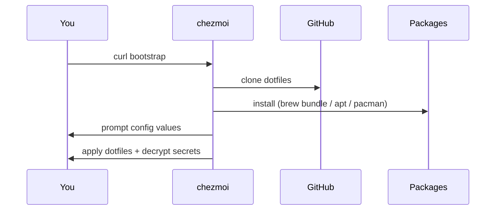

I've set up new machines enough times to know the pattern: it goes fine until it doesn't. You think you remember your `.zshrc`, and you mostly do, and then three weeks later you're wondering why `fh` doesn't exist and slowly piecing together what you'd built.

Dotfiles in a git repo solves this. Your config files — `.zshrc`, `.gitconfig`, `.ssh/config`, and the rest — are versioned, and restoring them on a new machine takes minutes instead of an afternoon of archaeology.

## Why chezmoi

The classic approach is symlinks: tools like `stow` or `yadm` link files from your home directory into the repo, so edits are tracked immediately. It works, but permissions, secrets, and machine-specific config all need extra glue.

I use [chezmoi](https://chezmoi.io/). A few things sold me on it:

**Copy, not symlink.** chezmoi physically copies files to their target locations. Permissions are handled cleanly, and you don't get surprised when a tool follows a symlink somewhere unexpected.

**Templating.** Config files can be Go templates with variables you define at setup time. My shell adapts based on which OS and tools are present — no runtime detection in shell configs, no separate branches.

**Built-in age encryption.** Secrets live encrypted in the public repo and are decrypted on apply. No separate secret store to maintain.

**One-command bootstrap.** On a fresh machine with nothing installed, one command goes from zero to fully configured.

## The bootstrap

### macOS

```bash
sh -c "$(curl -fsLS get.chezmoi.io)" -- init --apply boranuzun
```

### Linux

```bash
sh -c "$(curl -fsLS get.chezmoi.io)" -- -b ~/.local/bin init --apply boranuzun
```

The Linux variant installs chezmoi to `~/.local/bin` first, then runs the same init flow. Both commands do the same thing end-to-end:



The `run_once_before_` scripts only execute once per machine — chezmoi tracks them by content hash. They run in lexicographic order:

1. `run_once_before_10-install-homebrew.sh.tmpl` — installs Homebrew on macOS (no-op on Linux)
2. `run_once_before_20-install-packages.sh.tmpl` — `brew bundle` on macOS; `apt`/`pacman` on Linux

After that, chezmoi applies every tracked config file to its target location, decrypting secrets along the way.

### Setup prompts

On first apply, chezmoi asks three questions:

| Prompt | Stored as |
| --- | --- |
| Email address | `data.email` |
| Full name | `data.name` |
| Is OrbStack installed? | `data.hasOrbStack` |

Answers are saved to `~/.config/chezmoi/chezmoi.toml` and never asked again.

### Post-bootstrap manual steps

Two things aren't automated. You do these once after bootstrapping:

- **GitHub CLI** — `gh auth login`
- **(macOS) 1Password SSH agent** — enable in 1Password settings; the SSH config already points to it

## Secrets without paranoia

Three files contain sensitive information: git config (name and email), SSH config (host definitions), and GitHub CLI auth tokens. They can't live as plaintext in a public repo.

chezmoi integrates with [age](https://age-encryption.org/). Each secret file is encrypted with my age public key and committed as a `.age` file. chezmoi decrypts them on `apply` using the private key at `~/.config/chezmoi/key.txt`. That key lives in 1Password and needs to be placed at that path before bootstrapping — it's the one manual prerequisite.

Editing a secret works exactly like editing any other tracked file:

```bash
# Opens the decrypted content in $EDITOR, re-encrypts on save
chezmoi edit ~/.config/git/config
```

No manual encrypt/decrypt steps. chezmoi handles the round-trip.

## Templated configs

I use OrbStack on my Mac but not on Linux. On Linux I prefer native package managers (`apt`, `pacman`) over Homebrew. Rather than maintaining separate branches, Go template conditionals handle this using `.chezmoi.os`.

My `~/.zprofile` source file (`dot_zprofile.tmpl`) looks like this:

```bash
source ~/.profile

{{- if eq .chezmoi.os "darwin" }}
eval "$(/opt/homebrew/bin/brew shellenv)"
{{- end }}

{{ if and (eq .chezmoi.os "darwin") .hasOrbStack -}}
# OrbStack
source ~/.orbstack/shell/init.zsh 2>/dev/null || :
{{- end }}

export PATH="$PATH:$HOME/.local/bin"
```

The Homebrew `eval` only renders on macOS. The OrbStack block only renders on macOS with `hasOrbStack` set. On Linux, the rendered file is just those two lines. All platform logic stays in templates — shell configs never check the OS at runtime.

The same pattern applies throughout: `aliases.zsh.tmpl`, `env.zsh.tmpl`, and `omz.zsh.tmpl` all gate OS-specific blocks with `.chezmoi.os`.

## The shell setup

The Zsh configuration is split into focused modules under `~/.config/zsh/`:

| File | Purpose |
| --- | --- |
| `env.zsh.tmpl` | `$PATH` (Homebrew path on macOS, `~/.local/bin` on Linux), `$EDITOR`, locale, Bun, Starship, zoxide |
| `history.zsh` | History file size (1,000,000 entries), dedup settings |
| `fzf.zsh` | fzf key bindings, `bat`/`eza` previews, yazi shell wrapper |
| `omz.zsh.tmpl` | Oh My Zsh theme (none — Starship handles the prompt), plugins list |
| `aliases.zsh.tmpl` | All shell aliases, OS-specific variants |
| `.zshrc` | Sources all modules in order |

The tools:

- **[Starship](https://starship.rs/)** — cross-shell prompt with git status, language versions, and execution time. I picked this over Oh My Zsh themes because it works the same on every shell and every machine.
- **[zoxide](https://github.com/ajeetdsouza/zoxide)** — `cd` that learns. After a week it knows where you go and `z proj` beats `cd ~/Documents/Coding/Github/project` every time.
- **[eza](https://github.com/eza-community/eza)** — `ls` with colour, icons, and git status
- **[bat](https://github.com/sharkdp/bat)** — `cat` with syntax highlighting
- **[yazi](https://yazi-rs.github.io/)** — terminal file manager with image previews and `bat`/`eza` integration
- **[Ghostty](https://ghostty.org/)** — my terminal. Fast, native, and the config file is just text you can check in.
- **[fastfetch](https://github.com/fastfetch-cli/fastfetch)** — system info display

The aliases I actually use:

| Alias | Expands to | What it does |
| --- | --- | --- |
| `ls` | `eza --color --icons --long --header --git` | Long listing with git status |
| `lt` | `eza --tree --level=2 --long --icons --git` | Tree view, 2 levels deep |
| `cd` | `z` | zoxide smart directory jump |
| `ff` | `fastfetch` | System info |
| `sysup` | macOS: `brew upgrade; mas upgrade; omz update` / Arch: `sudo pacman -Syu; omz update` / Debian: `sudo apt update && sudo apt upgrade -y; omz update` | Update everything for your platform |
| `fh` | `fc -l 1 \| tac \| fzf` | Fuzzy search through full shell history |
| `gh-create` | `gh repo create --private ...` | Create a private GitHub repo and push the current directory |
| `opc` | `opencode` | AI coding assistant |
| `cm` | `chezmoi` | chezmoi shortcut |
| `rr` | `source ~/.zshrc` | Reload shell config without opening a new terminal |
| `ql` | `qlmanage -p` | Quick Look preview (macOS only) |
| `idea` | IntelliJ IDEA Ultimate | Launch IDE (macOS only) |

## Day-to-day workflow

After the initial bootstrap, chezmoi mostly disappears. To edit a tracked file:

```bash
# Opens the source file in $EDITOR and applies on save
chezmoi edit ~/.zshrc

# Or edit and apply immediately
chezmoi edit --apply ~/.zshrc
```

To preview what would change before applying:

```bash
chezmoi diff
```

When I want a change on other machines:

```bash
cd ~/.local/share/chezmoi
git add -A && git commit -m "chore: update aliases"
git push

# On any other machine (Mac or Linux):
chezmoi update
```

`chezmoi update` pulls and applies in one step. Same flow as the initial bootstrap, just incremental.

## The repo

The full setup is at [github.com/boranuzun/dotfiles](https://github.com/boranuzun/dotfiles). Steal whatever's useful.
