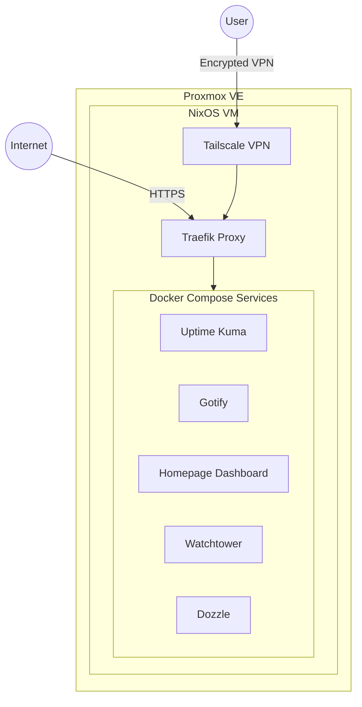
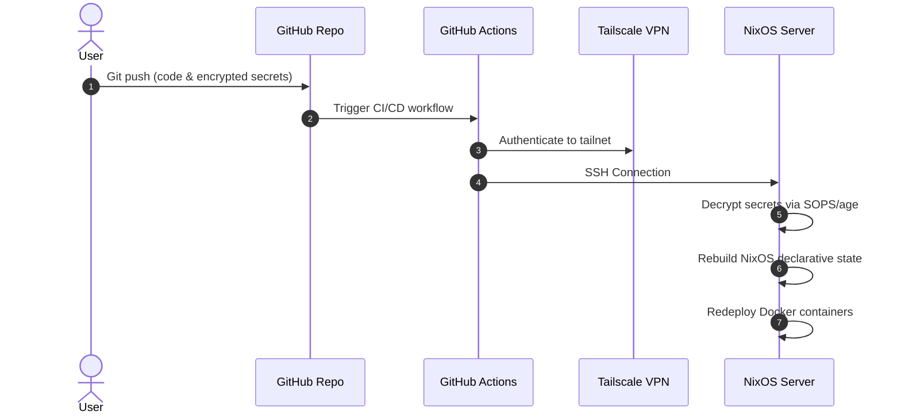

For my Bachelor's thesis, titled _"Conception et déploiement automatisé d'un Operating System as Code à l'aide de pratiques Infrastructure as Code"_, I took my manually configured homelab and completely rebuilt it as a fully automated, reproducible environment. I wanted to see if I could apply corporate Infrastructure as Code (IaC) and GitOps practices to a personal server setup to fix the headache of losing track of configurations over time.

## The Architecture

The main idea was to manage everything, from the Proxmox hypervisor down to individual Docker containers, using code. Instead of clicking through menus or running one-off CLI commands, my entire setup is written declaratively, version-controlled in Git, and deployed through a CI/CD pipeline.

### Infrastructure and Provisioning

I use Proxmox VE to manage the hardware. For provisioning the virtual machines, I went with OpenTofu (the open-source fork of Terraform) and the `Telmate/proxmox` provider. By writing out the CPU, memory, and disk allocations in HCL, OpenTofu handles creating and modifying the VMs idempotently. If I need to change a disk size or add RAM, I just update the code, run `tofu apply`, and it figures out the rest.

### NixOS: The Operating System

The most interesting piece of the puzzle is NixOS. On a standard Linux distro, configuration drift is inevitable. NixOS runs differently. You define the entire system in `.nix` text files. This includes packages, users, networking, and systemd services.

I used **Nix Flakes** to pin down dependencies to exact cryptographic hashes. This means if I rebuild the server in two years, I get the exact same system I have today with no version conflicts. And because Nix stores packages in an isolated `/nix/store`, updates are atomic. If I break the system during an update, a quick reboot rolls it back to the previous working state.

### Containers and Services

I considered Kubernetes, but for a single-node homelab, it’s an unnecessary overhead. Docker Compose gave me exactly what I needed: a pragmatic, declarative way to run my services without overcomplicating things.

The stack includes:

- **Traefik** as a reverse proxy, handling SSL certificates automatically via Cloudflare DNS challenges.
- **Uptime Kuma** and **Gotify** for monitoring and push notifications.
- **Watchtower** and **Dozzle** for automatic updates and log viewing.
- **Homepage** to tie it all together in a single dashboard.

### Networking and Secrets

Instead of opening ports to the public internet or relying on a traditional VPN, I used **Tailscale**. It sets up a WireGuard-backed mesh network that authenticates every device individually. I can access my services securely from anywhere without touching my router's port forwarding settings.

Putting all your infrastructure in Git comes with a glaring problem: where do you put the API keys? I solved this using **SOPS** and **age**. SOPS encrypts only the values in my config files (like `.env` or `.tfvars`), leaving the keys legible so I can still see the file's structure in Git. Better yet, I wrote a pre-commit hook that automatically catches and encrypts any plain-text secrets before they can be accidentally pushed.

### The CI/CD Pipeline

At the end of the day, everything is automated through GitHub Actions.

When I push code to the `main` branch, the pipeline:

1. Connects to my Tailscale network.
2. SSHes into the NixOS server.
3. Decrypts the secrets using the server's private keys.
4. Rebuilds the OS state from the `.nix` files.
5. Updates and restarts any modified Docker containers.

## Documentation

Because the whole point of IaC is being able to reproduce things, I built a documentation site using Astro Starlight. It explains every architectural choice, configuration, and setup step so anyone else can clone the repo and actually understand what it does.
