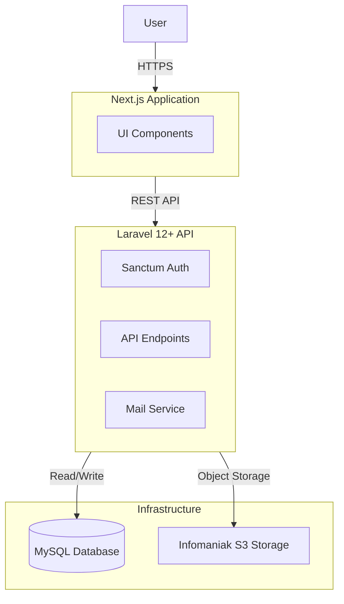

Comptarial is a web application I helped build for an accounting firm. The goal was straightforward: they needed a way to securely exchange tax returns and financial documents with their clients. We built this as part of a module at the Haute école de gestion de Genève (HEG), running the project as an Agile team using Scrum.

## The Architecture

We went with a decoupled architecture. A Next.js frontend handles the user interface, while a Laravel backend manages the heavy lifting.

### The Stack

- **Frontend:** It's written in TypeScript with Next.js. For styling, we used Tailwind CSS and pulled in raw components from shadcn/ui to build the interface quickly.
- **Backend:** We used Laravel 12+ to expose a REST API. It handles file routing, business logic, and automated emails.
- **Storage:** You don't want to store highly sensitive accounting documents on a standard web server's disk. We integrated Infomaniak's S3-compatible Swiss Backup to keep the files isolated and secure.
- **Database:** A standard MySQL database stores user data, role assignments, and document metadata.

### How It Works

The platform focuses on a few core problems accountants face every day:

- **Role-Based Authentication:** We used Laravel Sanctum to manage user sessions. Accountants see a dashboard with all their assigned clients, while clients only see their own files.
- **Document Transfers:** It's essentially a secure drop-box. Clients upload files through the React frontend, and the Laravel API pipes the data directly into the Infomaniak S3 bucket.
- **Account Management:** The fiduciary staff can create accounts. We added reCAPTCHA v3 to keep bots out of the public-facing forms.
- **Notifications:** The system sends out automated emails when a new document is uploaded, so the accountants don't have to keep refreshing a page to see if a client submitted their taxes.
