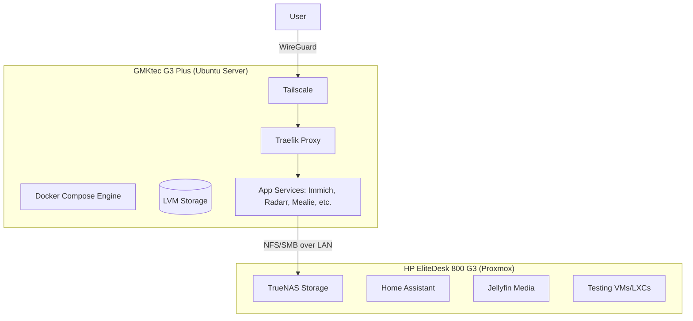

My homelab started as an experiment and evolved into the backbone of my digital life. I use it to pull my data away from large tech companies while constantly getting reps in with Linux, Docker, and network administration. It currently runs on a hybrid two-node architecture to separate bulk storage and heavy virtualization from lightweight applications.

## Physical Architecture

I use two distinct physical machines to route the workload efficiently.

### Node 1: The Workhorse

I run Proxmox VE on an HP EliteDesk 800 G3. It handles TrueNAS across two 8TB hard drives, which acts as the physical vault for my media. I also keep Home Assistant, AdGuard Home, and Jellyfin here. Beyond that, it's my sandbox. Whenever I want to test a new operating system or break an LXC container without taking down my main services, I spin it up on the EliteDesk.

### Node 2: The Engine

Almost everything else runs on a GMKtec G3 Plus with Ubuntu 24.04 Server. It hosts roughly 40 Docker containers ranging from Immich and Mealie to my whole observability stack (Prometheus, Grafana, Dozzle).

To manage disk space efficiently, I split the NVMe drive using Logical Volume Management (LVM). I created a 200GB volume strictly for generic containers, and cut out dedicated 50GB logical volumes for storage-heavy apps like Immich and Kavita so they don't consume the root partition.

## Networking and Access

I don't port-forward or expose any services to the public internet. Everything sits securely behind a Tailscale mesh network. When I connect to my tailnet, traffic hits Traefik, which handles internal routing and HTTPS mapping locally. It's safe, and I don't have to worry about random bots scanning my exposed IP addresses.

## Secrets and GitOps

I manage the Docker Compose configurations directly on the GMKtec. Whenever I change a compose file, I push the updates straight to GitHub for version tracking. It's less heavy-handed than a full CI/CD pipeline, but it gets the job done perfectly.

The obvious problem is committing `.env` files to a public Git repository. I solved this by carrying over the encryption workflow I built for my Bachelor's thesis. I use SOPS linked with age cryptography. A hook automatically catches any `.env` files before a commit and encrypts their specific values. The secrets stay safely encrypted on GitHub, but the server can transparently decrypt them locally using its private age key.
