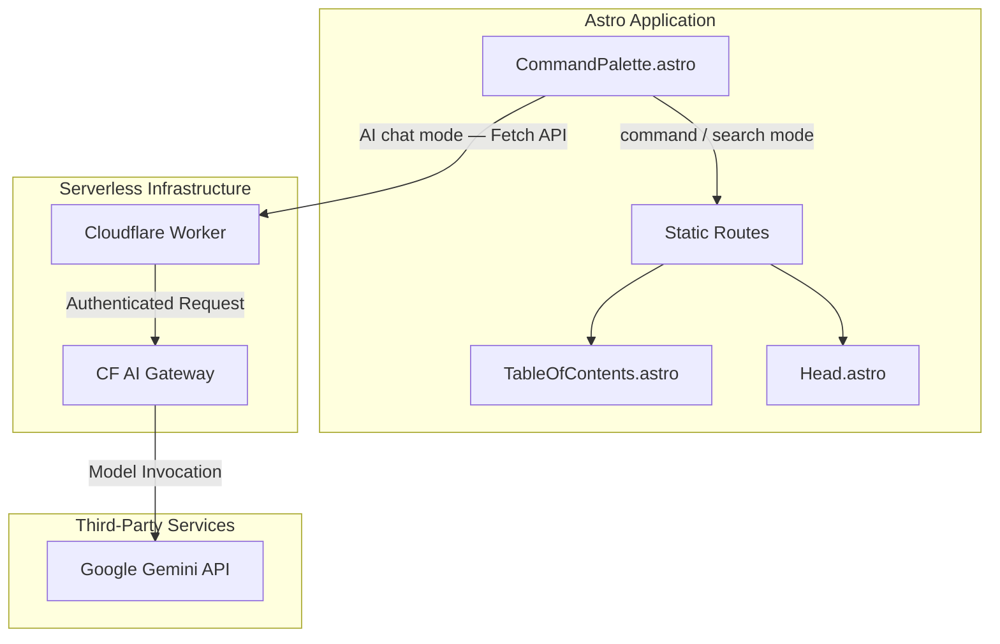
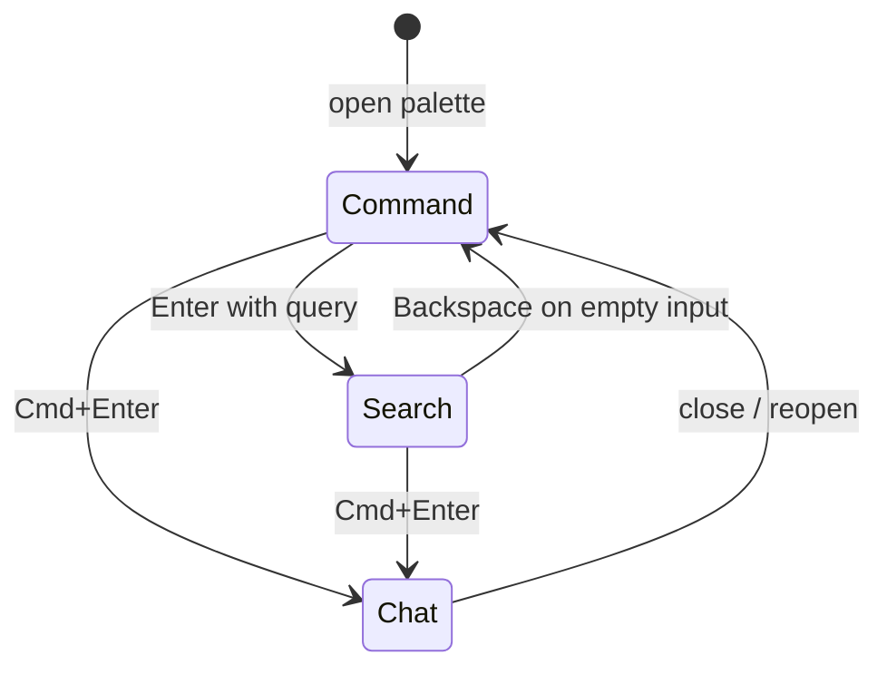
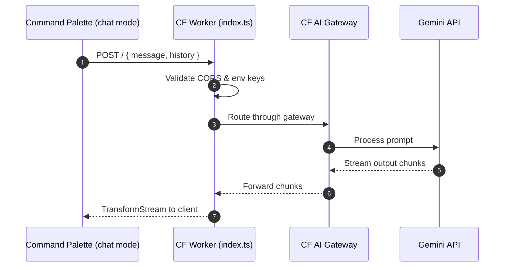

This is how I built my portfolio. I started with [Mark Horn's Astro Nano theme](https://astro.build/themes/details/astronano/) and heavily modified it — adding structured SEO data, a Mermaid diagram integration, and a UI redesign centered around a Cmd+K command palette.

My goal was a static site with just enough interactivity that visitors can navigate, search, and ask questions without needing to email me.

## Architecture

The site uses Astro 6 to generate static HTML. A lightweight Cloudflare Worker handles the AI backend. All content is managed through Astro's Content Layer API with typed Zod schemas.

## Command Palette (Cmd+K)

The palette is a multi-module TypeScript system under `src/lib/cmdk/` with three modes accessible from a single entry point:

| Mode        | Trigger         | What it does                                         |
| ----------- | --------------- | ---------------------------------------------------- |
| **Command** | Default on open | Navigate pages, toggle theme, jump to external links |
| **Search**  | Type → Enter    | Fuzzy-search across all blog posts and projects      |
| **AI Chat** | Cmd+Enter       | Streaming AI responses via Cloudflare Worker         |

The system is built as a state machine — `state.ts` owns the current mode and query; `registry.ts` holds the action definitions; `renderer.ts` reacts to state changes and repaints the list. Icons are centralized in `icons.ts` using Lucide SVGs and injected at init, keeping the Astro component markup clean.

### AI Chat Mode

The chat subsystem (`src/lib/cmdk/chat/`) handles streaming responses from a Cloudflare Worker. The worker acts as a proxy to Google Gemini with a rigid system prompt — it only discusses my professional background and refuses everything else. Responses stream back incrementally via `TransformStream`.

The Worker is also routed through Cloudflare's AI Gateway for request caching (`cf-aig-cache-ttl`). Common questions are served from cache instead of hitting the Gemini API again.

## Table of Contents Sidebar

Long-form content (blog posts, project pages) gets an auto-generated sticky TOC sidebar (`src/components/TableOfContents.astro`). It reads the heading structure from the rendered content and highlights the active section as you scroll.

## Mermaid Diagrams

A custom integration renders Mermaid diagrams from fenced code blocks in markdown. `MermaidSetup.astro` intercepts the blocks and converts them to SVG on the client side, keeping them functional across Astro's View Transitions and dark/light mode switches. The `mermaid: true` frontmatter flag enables it per-page.

## Structured JSON-LD Data for SEO

`src/lib/schema.ts` builds Schema.org-compliant objects for blog posts and projects. During the build, `Head.astro` calls these functions and feeds the output to `Schema.astro`, which injects the JSON-LD block into the HTML `<head>` for rich search result indexing.

## Content Layer API

The site uses Astro 6's Content Layer API with Zod schemas to type-check all content at build time. Collections are queried via `getCollection()` and `render()` — no runtime `Astro.glob()` calls.
