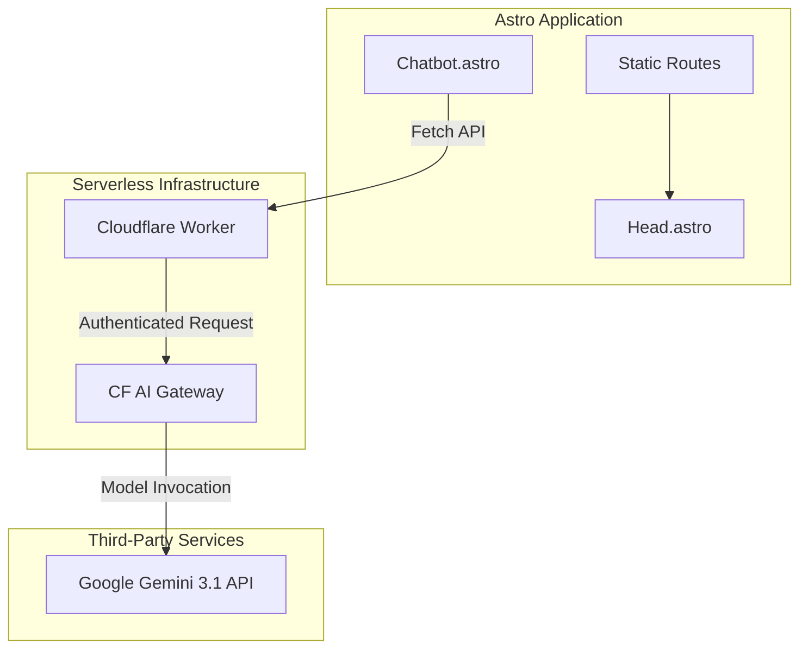
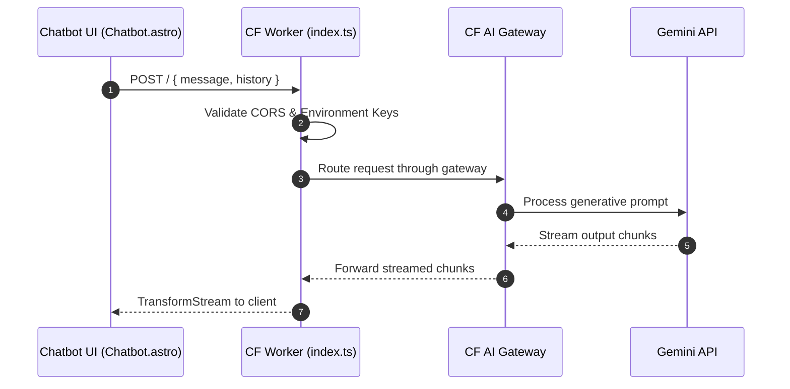
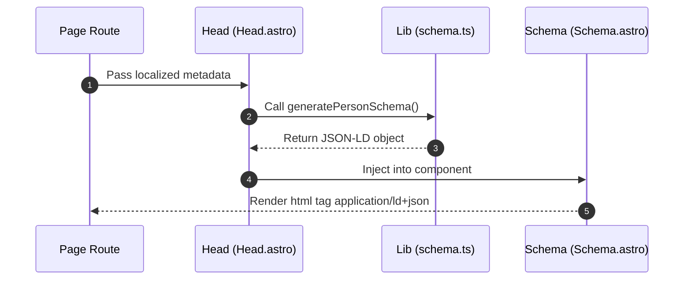

This documentation outlines the engineering and architectural decisions behind my personal portfolio website. Originally built upon the [Astro Nano theme](https://astro.build/themes/details/astronano/) by [Mark Horn](https://github.com/markhorn-dev), the underlying framework has been extended to support dynamic AI features and rigorous search engine optimization. 

My primary objective is to present a professional profile that is completely statically generated for edge-network speed, yet interactive enough to provide real-time information to recruiters and visitors.

## High-Level Architecture

The platform uses Astro as its main static site generator, combining lightweight UI components with a scalable serverless backend. To visually document the system design within this portfolio, I implemented a custom client-side integration for Mermaid diagrams. Using Astro's dynamic client scripts `(/src/components/MermaidSetup.astro)`, standard markdown codeblocks are intercepted and rendered to reactive SVGs on the fly, fully supporting Astro's View Transitions and dynamic light/dark mode toggling.

## The Serverless AI Chatbot

Providing visitors with an interactive method to query my experience requires a resilient and context-aware chatbot system.

### Frontend Integration

The user interface resides in `(/src/components/Chatbot.astro)`. It uses an internal browser state variable to retain conversation history across page navigation, leveraging Astro's native View Transitions. When a user submits a query, the component fires a `POST` request containing both the immediate prompt and the stored conversation context. To maintain an uninterrupted user experience, the response leverages a stream reader and transforms into HTML incrementally.

### Backend and Guardrails

The server-side proxy is a Cloudflare Worker `(/chatbot-worker/src/index.ts:fetch)`. It initializes the Google Generative AI client and intercepts queries to enforce strict operational guardrails. A detailed system prompt confines the model to solely answering questions related to my professional background, actively turning away off-topic inquiries.

By routing the API calls through the Cloudflare AI Gateway, the worker achieves request caching utilizing `cf-aig-cache-ttl`. This protects against redundant user queries and dramatically lowers subsequent Google API costs.

## Structured JSON-LD Data for SEO

To maximize organic discoverability, the site dynamically outputs structured schema data. This approach guarantees search engine crawlers can precisely catalog entities, such as blog posts and specific projects, within rich search results.

As demonstrated in `(/src/lib/schema.ts:generatePersonSchema)` and `(/src/lib/schema.ts:generateBlogPostingSchema)`, the application builds strict JavaScript objects compliant with Schema.org specifications. The `(/src/components/Head.astro)` component invokes these functions during build time, feeding the localized data into `(/src/components/Schema.astro)`. This ultimately appends the corresponding JSON-LD script block directly into the HTML `<head>` tag.

