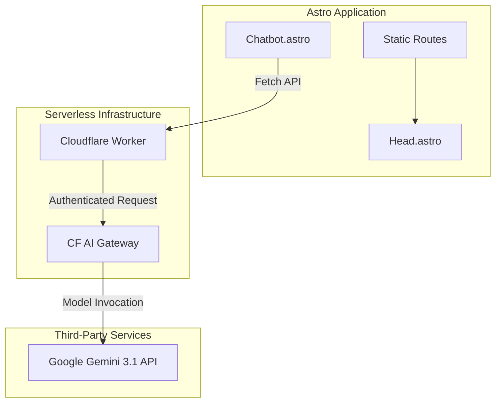
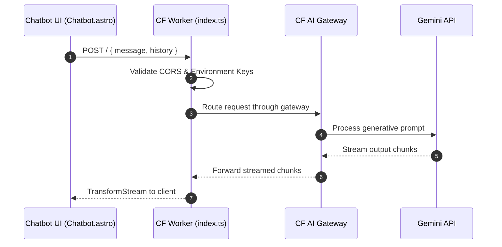
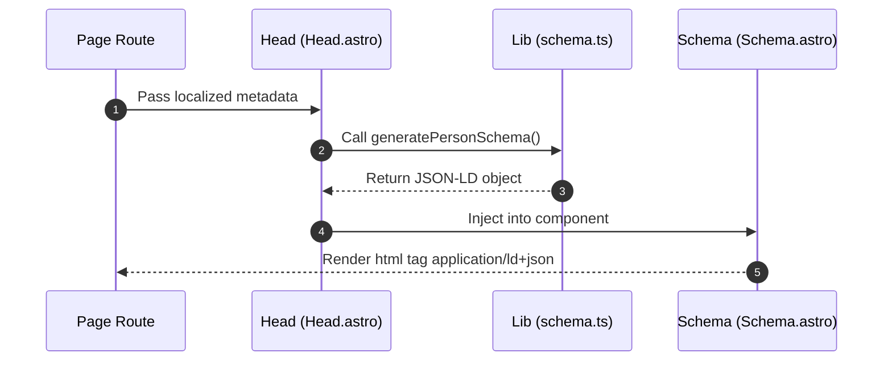

This is how I built my portfolio. I started with [Mark Horn's Astro Nano theme](https://astro.build/themes/details/astronano/) but ended up modifying it heavily to add an AI chatbot and structured SEO data.

My goal was simple: serve a static site for maximum speed, but add just enough interactivity so people can ask questions about my work without needing to email me.

## Architecture

The site uses Astro to generate static HTML, combined with a lightweight serverless backend. Since I like documenting my work, I also built a custom integration to render Mermaid diagrams right from markdown blocks. Using Astro's dynamic client scripts (`/src/components/MermaidSetup.astro`), it intercepts the code blocks and converts them to SVG on the client side, keeping them fully functional across Astro's View Transitions and dark mode switches.

## The AI Chatbot

I built a simple chatbot so visitors can query my experience directly.

### Frontend

The UI lives in `/src/components/Chatbot.astro`. I used a browser state variable to keep the conversation history intact while you navigate between pages. When you hit send, it fires off a `POST` request with your prompt and the context. The response streams back incrementally so there's no awkward loading pause.

### Backend

The backend is a Cloudflare Worker (`/chatbot-worker/src/index.ts:fetch`) acting as a proxy. It initializes the Google Gemini client with a rigid system prompt—basically telling the model to only talk about my professional background and refuse everything else.

I routed the calls through Cloudflare's AI Gateway to take advantage of request caching (`cf-aig-cache-ttl`). If someone asks a common question, the gateway serves the cached response instead of pinging the Gemini API again, which keeps costs down.

## Structured JSON-LD Data for SEO

To help search engines actually understand the content, the site generates dynamic JSON-LD schema data. It makes sure blog posts and projects get indexed correctly for rich search results.

In `/src/lib/schema.ts`, I have a few functions that build Schema.org-compliant JavaScript objects. During the build process, `/src/components/Head.astro` calls these functions and feeds the output to `/src/components/Schema.astro`. That component then injects the final JSON-LD block directly into the HTML `<head>`.

